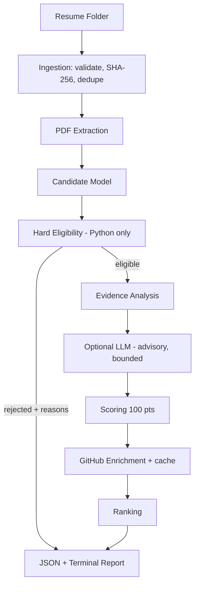

# AI Resume Screening System

A backend CLI that screens ~50 PDF resumes for an AI/Python SDE internship: it applies **deterministic** hard-eligibility rules, scores eligible candidates on the official 100-point model with **visible evidence**, enriches them from public GitHub, and writes a ranked JSON file plus a terminal summary.

No frontend, auth, database, or vector DB. Built to fit a 2–3 hour time box.

## Problem

Given a folder of resumes, decide who meets the hard bar (Python **and** real AI/agentic work), rank the rest fairly, and make every decision reviewable. Keyword counting fails here: "LangGraph" in a skills list is not the same as a stateful LangGraph agent with tools and evaluation.

## Solution

A four-stage pipeline: **deterministic → semantic → enrichment → ranking**.

1. Deterministic extraction and hard eligibility (pure Python, no model involved).
2. Evidence classification: *how convincingly* each skill is demonstrated.
3. Optional LLM pass for project-depth analysis, advisory only and bounded.
4. GitHub enrichment (eligible candidates only), then ranking.

## Architecture



```text
main.py                      CLI
src/pipeline.py              orchestration + per-resume failure isolation
src/ingestion/               file discovery, hashing, duplicate detection
src/extraction/              PDF text/links, sections, contacts, skills, profile builder
src/screening/evidence.py    signal patterns + evidence levels (the core of the analysis)
src/screening/eligibility.py hard rules      src/screening/scoring.py  100-point model, ranking
src/ai/                      LLMAdapter interface, schema validation, prompts, one provider
src/enrichment/              GitHub client + in-memory cache
src/reporting/               JSON + terminal output
scripts/make_sample_resumes.py   synthetic test resumes -> samples/resumes/
```

## Why This Architecture

Each stage has one job and can be tested without the others. The only stages that *decide* (eligibility, scoring, ranking) are deterministic, so results are reproducible and reviewable. The LLM and the network are optional, bounded, and replaceable.

## Pipeline

Per file, in a single pass: read bytes → SHA-256 → duplicate check → PDF parse → profile + evidence analysis → eligibility. Then, for eligible candidates only: optional LLM → scoring → GitHub → rank. Every file is isolated: a failure is recorded against that file and the batch continues.

## Eligibility

Eligible **only if both** hold (see `screening/eligibility.py`):

- **Python**: evidence in skills, summary, projects or experience. Mentions in education, certifications or free text are ignored. Python-ecosystem tools (FastAPI, Django, pytest...) count as Python evidence.
- **AI/agentic**: evidence **inside a project or job entry** (LLM, RAG, LangChain/LangGraph/LlamaIndex, embeddings, vector search, tool calling, agents, multi-agent, orchestration...). A skills-list-only mention is rejected with a specific reason. This is a deliberate reading of "meaningful evidence", documented here so reviewers can disagree with it.

JavaScript/Java/React/etc. never disqualify anyone. Rejections carry explicit reasons and `matched_skills`. If a resume has no recognizable Skills/Projects/Experience headings, the whole text is scanned (with slightly lower confidence) instead of auto-rejecting unusual layouts.

## Scoring

Official weights (`src/config.py`, asserted to sum to 100):

| Category | Max | How |
|---|---|---|
| AI / Agentic / RAG project depth | 40 | per project entry: base by evidence level (mention 5, implementation 11, deep 14) + sub-signals: retrieval 6, tool calling 6, state 5, evaluation 5, embeddings 4, orchestration 4, vector search 3, business logic 3. Best project counts fully, a second adds 25%. Skills lists contribute nothing. |
| Python & backend | 30 | Python 6, framework 4, async 3, SQL 3, Redis 3, REST 3, testing 3, architecture 2, error handling 2, concurrency 1 |
| Cloud / deployment / full stack | 15 | Docker 3, cloud provider 3, frontend 3, deployment 2, end-to-end 2, Kubernetes 1, Terraform 1 |
| GitHub activity | 10 | recent activity 0–5 + relevant maintained repos 0–5 |
| Engineering depth | 5 | testing, caching, queues, concurrency, observability, retry/failure handling, architecture, performance, DB indexing, rate limiting |

Non-AI categories scale each signal by its best evidence level: skills-only ×0.35, project mention ×0.6, implementation ×0.9, deep ×1.0.

Examples of the AI sub-score ladder (tested): RAG only < RAG + embeddings < RAG + tools + state < RAG + tools + state + evaluation.

**Thin-wrapper penalty (−10).** Applied only when *every* AI project is a bare hosted-model call (OpenAI/Claude/Gemini/prompt/chatbot terms) with **none** of retrieval, embeddings, vector search, tools, state, orchestration, evaluation or data/business logic. Using an API is never penalized by itself, and one substantive project removes the penalty. It is recorded in `penalties` with its reason.

`total = categories + penalties`, clamped to 0–100. **Ranking:** total ↓, then AI depth ↓, Python/backend ↓, engineering ↓, candidate name A→Z (then filename), so output is reproducible.

## Evidence Model

Every signal gets a level: `NONE < KEYWORD_ONLY < PROJECT_MENTION < IMPLEMENTATION < DEEP_IMPLEMENTATION`.

| Level | Trigger | Example |
|---|---|---|
| KEYWORD_ONLY | listed in skills/summary | `Skills: LangChain` |
| PROJECT_MENTION | named in a project/job entry, no implementation verb | `Used LangChain.` |
| IMPLEMENTATION | entry contains built/implemented/deployed... | `Built a RAG chatbot using LangChain and FAISS.` |
| DEEP_IMPLEMENTATION | implementation plus ≥3 related sub-signals in the same entry | chunking + embeddings + retrieval + tools + state... |

Evidence entries in the JSON carry `skill`, `section`, `evidence_text`, `confidence`, `level`, `source` (resume / github / llm), and the category they support. Signals proven by the same sentence are merged into one entry. `confidence` is explanatory metadata and never overrides eligibility.

## LLM Strategy

Optional and off by default (`LLM_PROVIDER` empty). The pipeline depends only on `LLMAdapter.extract_project_evidence()`; `AnthropicAdapter` is the one included provider.

- The LLM only sees eligible candidates' AI project text (capped at 6,000 chars); one call per eligible candidate.
- Output is schema-validated and clamped. Malformed output is an error, which triggers fallback.
- It may shift AI depth by at most ±6 points. It can't change eligibility, can't remove the thin-wrapper penalty, and can't touch other categories.
- Quoted evidence is kept only if it literally appears in the resume (guards against invented evidence).
- Resume text is placed in delimiters and the system prompt tells the model to treat it as data (prompt-injection mitigation). The ±6 bound is the backstop.
- **LLM failure → deterministic fallback → continue.**

## GitHub Enrichment

After eligibility, so rejected candidates cost no API calls. The username comes from a hyperlink annotation (preferred) or visible text. Two calls per unique username (profile + 100 most recently pushed repos). Forks are ignored.

- Activity (0–5): own repos pushed in the last 90 days (1→2, 2→3, 3–4→4, 5+→5).
- Relevant maintained repos (0–5): non-fork, non-archived, pushed in the last year, and Python or AI/ML-themed (1→2, 2→3, 3→4, 4+→5; +1 if one is AI/ML, capped at 5).
- Handled without crashing: missing link, invalid username (validated against GitHub's username rules before any request), 404, rate limit (also short-circuits remaining lookups), timeout, network error, bad JSON, unexpected exceptions. A GitHub failure scores 0 for that category and `confidence.github = 0`; it never rejects anyone.
- **Caching:** results are cached in memory per lowercase username, so one username is fetched at most once per run. This is rate-limit protection (60 requests/hour unauthenticated). Distinct usernames are fetched with a small thread pool (4 workers). There is no disk cache.

## Failure Handling

| Situation | Behavior |
|---|---|
| Not a PDF / corrupt / encrypted / oversized | `failed`, reason in report, batch continues |
| Blank or scanned (no text) | `empty`, reported (no OCR) |
| Non-PDF file in folder | `unsupported_format`, reported |
| Identical file content | later file marked `duplicate` of the first |
| Missing email / GitHub | fields are `null`, not an error |
| LLM error or garbage output | deterministic scoring |
| Any unexpected exception for one resume | that file is `failed`, others continue |

Parsing limits (10 MB, 15 pages) bound untrusted input.

## Testing

```bash
pip install -r requirements-dev.txt
pytest -q
```

60 tests: eligibility matrix (Python+AI, Python only, AI only, JS+React only, Python+JS+AI, skills-only AI), scoring (caps, totals, ladder, thin penalty, tie-breakers, LLM bounds), parser (valid/empty/malformed PDF, missing email/GitHub, link extraction, bullets), GitHub (success, 404, rate limit, timeout, invalid names, caching, all with mocked HTTP), and pipeline (a broken resume doesn't stop the batch, duplicates, summary arithmetic, LLM fallback, JSON shape).

## Setup

Python 3.10+.

```bash
python -m venv .venv && source .venv/bin/activate
pip install -r requirements.txt
cp .env.example .env     # optional; .env is git-ignored
```

| Variable | Purpose |
|---|---|
| `GITHUB_TOKEN` | optional; raises the API limit to 5,000/hour |
| `GITHUB_TIMEOUT` | seconds, default 8 |
| `LLM_PROVIDER`, `LLM_MODEL`, `LLM_API_KEY` | optional semantic layer (`anthropic`) |

## Running

```bash
python main.py --input ./resumes --output ./output/results.json
python main.py --input ./resumes --output ./output/results.json --verbose
# extras: --top N   --no-github   --no-llm
```

`resumes/` and `output/` are git-ignored (candidate data is PII). To try it without real resumes:

```bash
pip install -r requirements-dev.txt
python scripts/make_sample_resumes.py          # fictional candidates, incl. corrupt/blank/duplicate files
python main.py --input ./samples/resumes --output ./output/results.json
```

## Example Output

Terminal (sample resumes, `--no-github`):

```text
Parsing              ████████████████████ 10/10
Eligibility          ████████████████████ 6/6

Eligible: 3   Rejected: 3   Duplicates: 1   Failed: 3

#1  Asha Verma                  79/100
    AI/RAG       40/40
    Python       27/30
    Cloud         9/15
    GitHub        0/10
    Engineering   3/5
    ✓ AI project 'Policy Assistant': retrieval/RAG, embeddings, vector search, tool calling, ...
```

JSON (abridged):

```json
{
  "batch_summary": {"total_resumes": 10, "successfully_parsed": 6, "eligible": 3,
                    "rejected": 3, "duplicates": 1, "failed_or_unreadable": 3},
  "ranked_candidates": [{
    "rank": 1, "candidate_name": "Asha Verma", "total_score": 79,
    "score_breakdown": {"ai_project_depth": 40, "python_backend": 27, "cloud_fullstack": 9,
                        "github": 0, "engineering_depth": 3},
    "penalties": [], "why_this_score": "Strongest evidence came from 'Policy Assistant' ...",
    "evidence": [{"category": "ai_project_depth", "section": "projects",
                  "level": "DEEP_IMPLEMENTATION", "confidence": 0.95, "evidence_text": "..."}],
    "confidence": {"eligibility": 0.9, "project_analysis": 0.8, "github": 0.0}
  }],
  "rejected_candidates": [{"candidate_name": "Eli Thompson", "eligible": false,
    "rejection_reasons": ["No evidence of Python stack", "No AI/agentic project evidence"],
    "matched_skills": ["JavaScript", "React", "Node.js", "Express", "MongoDB"]}],
  "failed_resumes": [], "duplicates": [], "processing": []
}
```

`batch_summary` invariant: `total = successfully_parsed + duplicates + failed_or_unreadable`, and `successfully_parsed = eligible + rejected`.

## Design Decisions

- **Why deterministic eligibility?** Hard requirements should not depend on probabilistic model output.
- **Why optional LLM?** Semantic project-depth analysis benefits from an LLM, but the system must remain usable and testable without one.
- **Why no database?** Single-run batch processing does not require persistent storage.
- **Why no frontend?** The assignment explicitly prioritizes backend engineering.
- **Why GitHub enrichment after eligibility?** Avoid unnecessary API calls for obviously irrelevant candidates.
- **Why evidence spans?** A score without evidence is difficult to review.
- **Why caching?** Avoid repeated network requests and reduce rate-limit risk.
- **Why dataclasses instead of Pydantic?** The spec allows either; stdlib dataclasses keep the dependency list to `pypdf` and `requests`. LLM output, the one place that needs real validation, has an explicit validator (`ai/schemas.py`).

## Trade-offs

- Regex signal patterns are transparent and testable, but they miss paraphrases and can over-match (e.g. "validation" counts as business logic). The LLM layer exists to soften this, bounded to ±6.
- Scoring weights and level multipliers are hand-tuned, not calibrated against human rankings.
- Entry (project/job) boundaries are heuristic: blank lines, pipe-separated or dated title lines. A title with neither merges into the previous entry, which can over-credit "deep" evidence.
- One pass per file and no repeated network or model calls; GitHub concurrency is bounded at 4 threads.

## Limitations

- English-language, text-based PDFs only; no OCR and no DOCX.
- Evidence is claims on paper. Nothing verifies that a described project exists, and a GitHub link is not matched to the described projects.
- Skills-only AI is rejected by design (see Eligibility); a candidate with unusual headings and AI terms only under an unrecognized section may be treated as skills-only.
- Thin-wrapper detection is keyword-based.
- Duplicates are exact-hash only; the same resume re-exported from a different tool is not detected.
- The sample resumes are synthetic and short; real resumes are messier. Tune patterns against your real batch.
- The live GitHub API and live LLM provider paths are covered by mocked-HTTP unit tests; they have not been exercised against the real services in the environment this was built in.

## If I Had More Time

1. Better section-aware resume parsing and DOCX support.
2. Structured LLM evidence extraction with evaluation/calibration.
3. Bounded asynchronous enrichment with persistent caching.
4. Integration tests using realistic synthetic resumes and failure scenarios.
